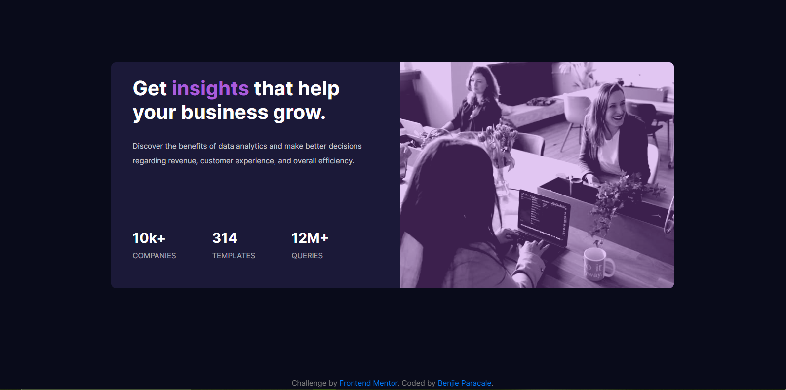

# Frontend Mentor - Stats preview card component solution

This is a solution to the [Stats preview card component challenge on Frontend Mentor](https://www.frontendmentor.io/solutions/html-css-and-bootstrap-S-_0BN_Sw). Frontend Mentor challenges help you improve your coding skills by building realistic projects. 

## Table of contents

- [Overview](#overview)
  - [The challenge](#the-challenge)
  - [Screenshot](#screenshot)
  - [Links](#links)
- [My process](#my-process)
  - [Built with](#built-with)
  - [What I learned](#what-i-learned)
  - [Continued development](#continued-development)
  - [Useful resources](#useful-resources)
- [Author](#author)
- [Acknowledgments](#acknowledgments)

## Overview

### The challenge

Users should be able to:

- View the optimal layout depending on their device's screen size

### Screenshot

### Links

- Live URL: [https://benjzp.github.io/Stats-Preview-Card](https://benjzp.github.io/Stats-Preview-Card/)

## My process

### Built with

- Semantic HTML5 markup
- CSS custom properties
- Bootstrap 4

### What I learned
I learned how to use HTML, CSS and Bootstrap also how to make your website responsive. 

### Continued development

It is really true the saying that if you want to be good at coding you need to apply what you have learned in the past few days.

### Useful resources

- [FreeCodeCamp Bootstrap](https://www.freecodecamp.org/news/tag/bootstrap-4/) - This helped me on how to put BootStrap on the HTML and how to use bootstrap classes.
- [MDN Web Docs CSS](https://developer.mozilla.org/en-US/docs/Web/CSS) - This helped me in the CSS.
- [Github Tutorial](https://www.youtube.com/watch?v=wrb7Gge9yoE&t=235s) - This helped me how to upload repositories in Github.

## Author
- Frontend Mentor - [BenjZP](https://www.frontendmentor.io/profile/BenjZP)
- Twitter - [@url_benjjj](https://twitter.com/url_benjjj?s=09)

## Acknowledgments
I would like to give an acknowledgement to [0rukoSaki](https://github.com/0rokuSaki/stats-preview-card-component) on his repository. I used his repository as a reference on how to start this project since this is my first time to code.

